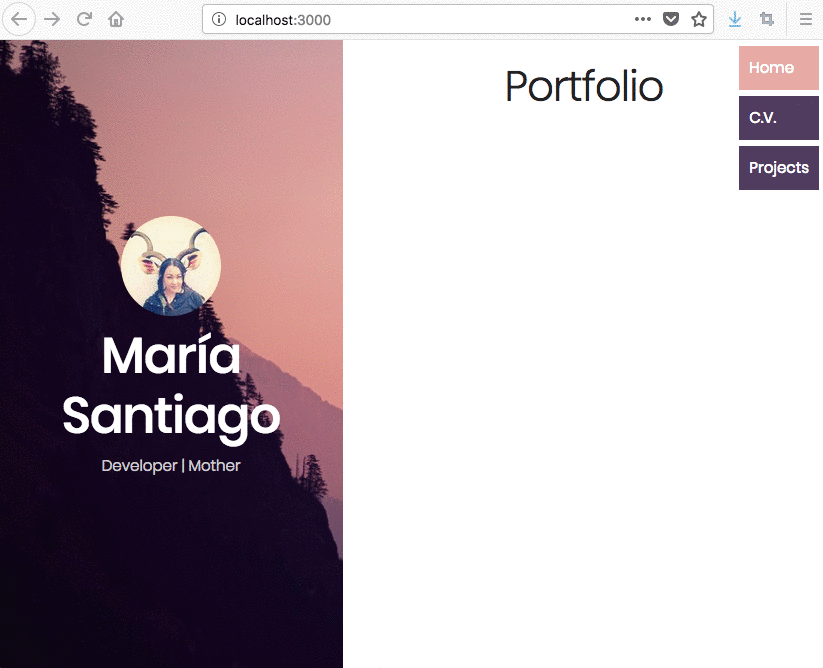

# React Portfolio - Part 4 - React Router

## Context
María Santiago, a talented designer and full stack developer, has become interested in React and wants to convert her vanilla html/css/js portfolio to React components. She is unfamiliar with the technology, and she has contracted you, a specialized front-end developer, to help her with this project.

You will rebuild her portfolio project from start to finish, starting with basic JSX components and ending with stateful components that implement simple interactivity.

Here is a demo of the sequence of tasks: [Maria Portfolio](https://vanilla-to-react.surge.sh/). In order for your components to render correctly, you will need to have a similar HTML structure with similar class names. You will not need to write CSS for this project because María already has the class names and html structure.

## The Assignment
You will need to configure the project with the `react-router-dom` library. The user should see the correct View component rendered when navigating to
```
- `/`           -->   HomeView
- `/cv`         -->   CvView
- `/projects`   -->   ProjectView
```

+ **Part A** - in `index.js`
  - configure `BrowserRouter` in `index.js`

+ **Part B** - in `App.js`
  - configure `<Router>`, `<Switch>`, `<Nav>` components in `App.js`

+ **Part C** - in `Nav.js`
  - configure `<NavLink>` components in `Nav.js`


### Setup Instructions

1. Project Setup from Terminal
```sh
# (1) Navigate to your assignments directory
cd ~/Documents/muktek/assignments

# (2) create the application and cd into it
create-react-app assignment--react-router
cd assignment--react-router

# (3) delete everything in the src/ folder
rm -rf ./src/*

# (4) Download project src files and unzip them into the src directory
curl https://raw.githubusercontent.com/muktek/assignment--react-portfolio-04-react-router/master/src-files.zip > src-files.zip

unzip src-files.zip -d ./src/

# (5) return to project root directory and start the react task runner
cd ..
npm start
```

2. Additional Configuration:
  - For fonts + icons:
    - The project uses Poppins font family (from Google Fonts) and [ionicons](http://ionicons.com/) for icon fonts.
    - You will need to link to the files from a CDN in the `<head>` of the `index.html` inside the `public/` directory.
    - in `public/index.html`
      ```html
      <head>
        ...
        <title>Portfolio</title>
        <link href="https://fonts.googleapis.com/css?family=Poppins:200,300,400,500,600,700,800" rel="stylesheet">
        <link rel="stylesheet" href="https://cdnjs.cloudflare.com/ajax/libs/ionicons/2.0.1/css/ionicons.min.css">
      </head>
      ```
  - For project CSS styles:  
    - They are included in the setups


## Expected Result

1. The proper view should render on change of URL
2. The proper nav link should highlight if URL is active


